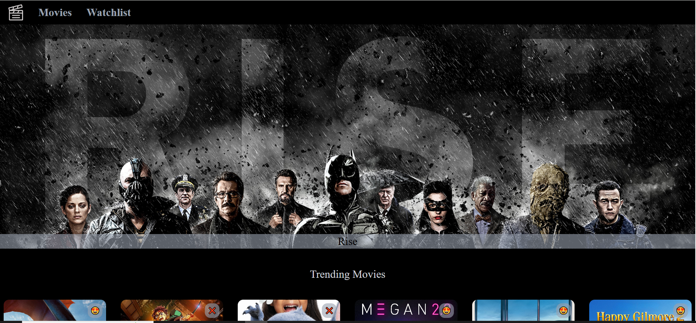
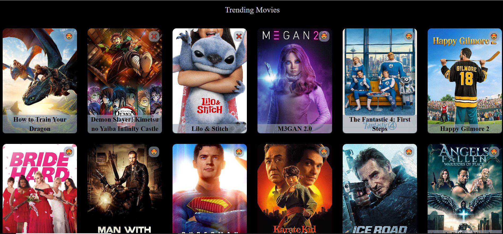
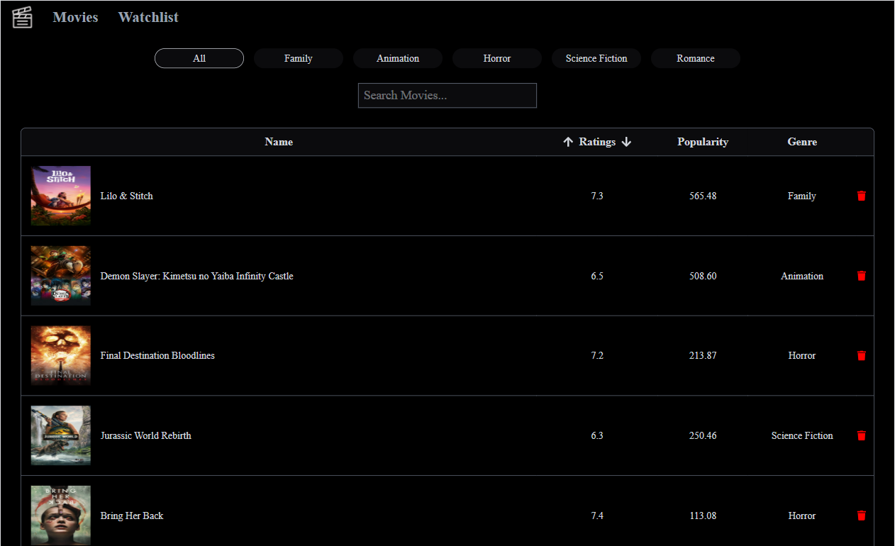
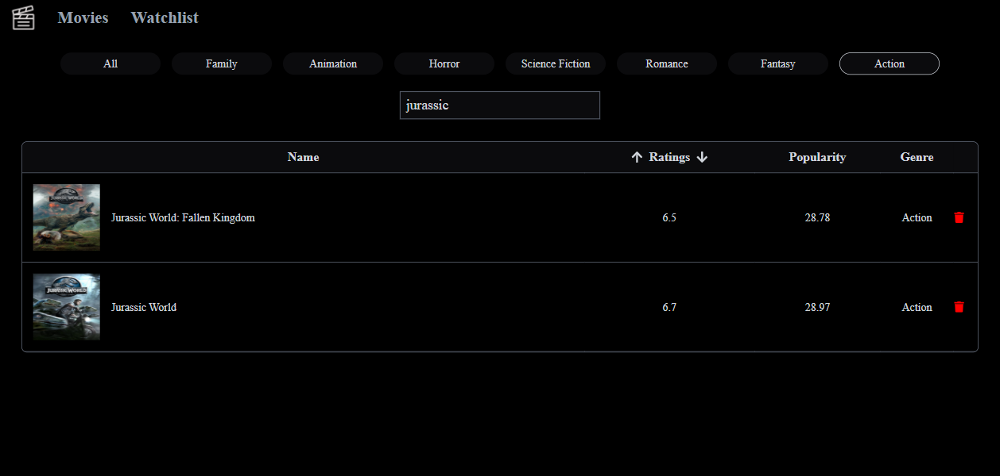

# 🎬 Mini Imdb Clone

A responsive and interactive web application built using **React** that allows users to:

- Browse trending movies from **The Movie Database (TMDB) API**
- Add/remove movies to a **personal watchlist** (stored in `localStorage`)
- Filter movies by genre
- Search watchlisted movies by **movie title**
- Sort watchlisted movies by **rating**
- Navigate between pages using **React Router**

---

## 🚀 Features

- 🌐 **Trending Movies Page** with pagination
- ❤️ **Add to/Remove from Watchlist**
- 🔍 **Search** and 🎯 **Genre-based filtering**
- 🔼🔽 **Sort movies** by rating (ascending/descending)
- 💾 Persistent data storage using `localStorage`
- 🎨 Styled using **TailwindCSS**
- 📦 API integration using `axios`

---

## 📸 Screenshots


<details>
  <summary>Movie List Page (Trending Movies)</summary>

  - Displays popular movies with poster & title
  - Click 😍 to add/remove from watchlist
  - Responsive grid layout

</details>

Trending movies



<details>
  <summary>Watchlist Page</summary>

  - Lists all added movies with filtering, searching & sorting options
  - Displays poster, title, rating, popularity & genre
  - Option to remove from watchlist

</details>


Filter and search functonality



---

## 🛠️ Tech Stack

| Technology       | Usage                        |
|------------------|------------------------------|
| React            | Frontend framework           |
| React Router     | Routing                      |
| Axios            | API calls to TMDB            |
| TailwindCSS      | Styling                      |
| LocalStorage     | Persisting watchlist         |
| TMDB API         | Movie data source            |
| Vite             | Fast bundling and development server |

---

## 🧾 Folder Structure

```bash
public/
├── logo.png
src/
├── components/
│ ├── Banner.jsx
│ ├── MovieCard.jsx
│ ├── Movies.jsx
│ ├── Navbar.jsx
│ ├── Pagination.jsx
│ └── WatchList.jsx
├── Utility/
│ └── genre.js
├── App.jsx
├── index.css
└── main.jsx
├── .env

```

---


## 🔑 TMDB API Key Setup

1. Create a free account at [TMDB](https://www.themoviedb.org/)
2. Get your API key from your profile > Settings > API
3. Create a `.env` file in the root of the project and add:
4. Add the following line:

```bash
VITE_API=your_tmdb_api_key
```

5. Restart your development server.

---
## 🚀 Getting Started

### 🔁 1. Clone the Repository

```bash
git clone https://github.com/your-username/react-movie-watchlist.git
cd react-movie-watchlist
```

### 📦 2. Install Dependencies

```bash
npm install
```

### 🧪 3. Run the Development Server
```bash
npm run dev
```
App will be available at: http://localhost:5173

### 🏁 4. Build for Production
```bash
npm run build
```

---

## 🙌 Acknowledgements
- TMDB - The Movie Database
- React
- Tailwind CSS
- Vite

